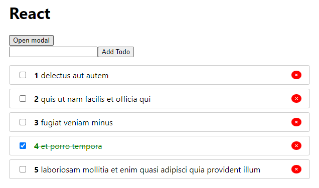

# minin-react

## ToDo app on React

## Project Installation

| Script | Destination |
| ------ | ----------- |
| npm install | Setting Dependencies |
| npm run start | Starting a server for project development |
| npm run build | Build a project |