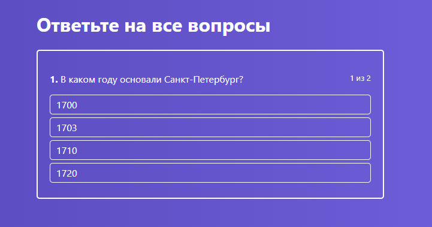
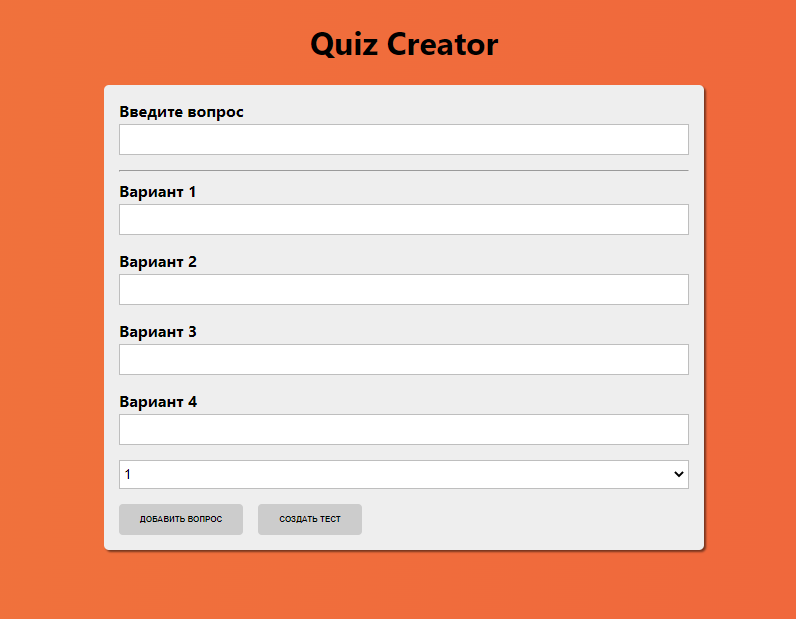
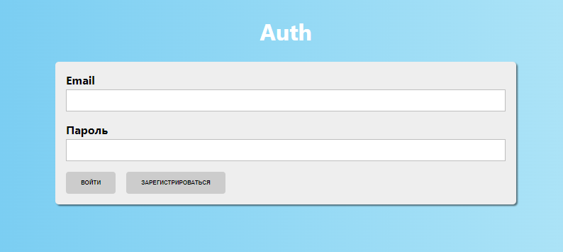

# react-quiz

## The application for creating and taking tests. 

The application consists of two parts: a general part and an administrator's part. In the admin area, you can create tests, for each of which you will be able to create questions and different answer choices, as well as to specify the correct answer. In the general part of the application, the created tests are displayed, in which the end user can select and pass any selected test by answering questions.

The components and functionality of the application were chosen so as to fully cover the development of elements of any sites and SPA for desktops and mobile devices.

The result is a clear example of the application of ALL the relevant technologies for creating reactive fully adaptive SPAs and their interaction. On the basis of these components it is possible to create an application of almost any functionality.

***

## Project Installation

| Script | Destination |
| ------ | ----------- |
| npm install | Setting dependencies |
| npm run start | Starting a server for project development |
| npm run build | Build a project |